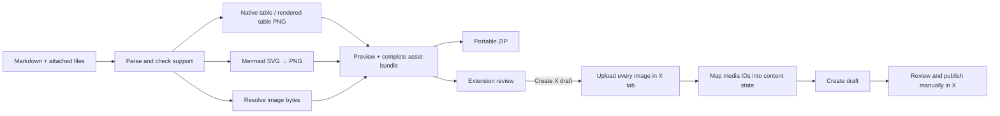

# How the importer works

Date: **2026-09-15** · Status: prototype

## Kaitox’s mechanism

Kaitox parses Markdown into X’s structured article content state. Text becomes blocks with inline formatting ranges. Each media block points to an entity containing an uploaded media ID. Tables and fenced code use `MARKDOWN` entities. Mermaid fences are rendered to PNG before this conversion, so the converter treats diagrams like ordinary images.

Its extension uses an authenticated X browser session and X’s private web endpoints. A local relay connects CLI/editor workflows to that extension. Calling its function named `publishArticle` creates a draft; it does not mean the article has been publicly published.

Article Studio reuses the npm converter, SVG normalization, and `XArticleClient`. A web app supplies the writing interface and talks directly to its own companion through a bounded page-message protocol, so there is no relay process. It does not copy Kaitox’s full extension, branding, or service.

## Boundaries in this implementation

| Layer | Responsibility | Main files |
| --- | --- | --- |
| Planner | Optional H1 with editable title fallback; normalize safe HTML and Obsidian image embeds, retain reference definitions, verify content and asset placement against Kaitox output; optional wikilink and shell-pipe warnings; explicit footnote → endnote and nested-list conversions | `src/plan.ts`, `src/normalize.ts`, `src/settings.ts` |
| Image resolution | Match attached files, reject ambiguous paths, CORS downloads without credentials, byte sniffing; SVG rasterization and downscaling over 5 MiB | `src/files.ts`, `src/images.ts` |
| File access | Chromium File System Access: remembered Markdown and image-folder handles for Reload from file and automatic folder matching; standard inputs elsewhere | `src/filesystem.ts`, `src/storage.ts` |
| Agent skill | The same planner bundled for Node (`pnpm build:skill`), local image/cover resolution, remote downloads, playwright-cli scripts | `src/core.ts`, `scripts/build-skill.mjs`, `skills/md2xarticle/` |
| Rendering | Mermaid strict mode, normalized SVG rasterization, table canvas rendering | `src/render.ts` |
| Preparation | Cached successful assets; dimensions, SHA-256, sanitized preview, complete ZIP or independent source backup | `src/prepare.ts`, `src/portable.ts`, `src/backup.ts` |
| Editor | Source/asset/preview views, wrapped line-number gutter, error navigation, import, persistence | `src/App.tsx`, `src/MarkdownEditor.tsx`, `src/ArticlePreview.tsx`, `src/storage.ts` |
| Web bridge | Request IDs, status/stage messages, bundle validation | `src/bridge.ts` |
| Extension | Origin checks, IndexedDB jobs, own review page, draft creation state | `extension/src/` |
| X runner | Same-origin session use, media upload, content-state creation, private draft mutation | `extension/src/x-runner.ts` |

Generated images use opaque source keys such as `studio-asset://mermaid-1.png`. These keys are never fetched as URLs. They map to actual bundled bytes. Portable ZIP export rewrites only image destinations to `assets/...`; identical text in prose or code is not rewritten.

The preview runs Kaitox’s converter and sanitizes the resulting HTML. It uses temporary object URLs for prepared images. Preview typography is a local approximation; it is not an embedded X editor.

Media figures are associated with their source assets in renderer order, including repeated occurrences. `ArticlePreview` adds React image controls alongside sanitized blocks; those controls are never included in clipboard HTML or exported Markdown. Per-image replacement undo restores the previous explicit mapping, or removes the override to restore original resolution. Undo lasts for one replacement per source in the current session; selected files still persist in IndexedDB.

Local Markdown contains paths, not image bytes. File selection exposes only filenames, while directory selection exposes paths relative to the chosen root. The resolver prefers exact paths, then the longest matching trailing path, and accepts a unique filename when no directory match exists. Equal matches and filename-only matches to distinct article paths remain ambiguous. Explicit per-image choices take precedence. Folder matching filters to referenced files, ignores other Markdown/images in the selected directory, and rebinds matched sources to repair previous incorrect choices.

Every explicit Markdown import starts with only the attachments supplied in that import, even when its filename and text are unchanged. It clears overrides, undo, progress, and the previous prepared bundle/object URLs. Imports use a sequence guard so a delayed earlier file read cannot overwrite a newer import or a New/Example action. Page reload still resumes the saved current draft, including its selected images.

The editor automatically prepares assets after a short pause in typing. Each request is cancelled when its input changes; stale results are disposed and cannot enable a complete export or draft creation. Successful asset bytes are reused across title/text edits when the selected File, remote URL, diagram code, or table cells match. Each preparation owns independent object URLs. Retry clears the cache; New, Example, and imports reset it. Failures are not cached. An existing preview image can remain visible only when the attached files, document path, image source, and generated-image inputs still match. Drawer thumbnails also match by source rather than ordinal asset ID. Updating status accounts for changed inputs immediately, before the preparation effect starts. The UI never writes to X during this process.

Title, body copy, source backup, and X handoff have separate readiness conditions. A missing H1 never blocks handoff: the title field falls back through metadata, H1, filename, and Untitled article. Body copy uses the current plan and marks unprepared images. Source backup does not require conversion and includes the exact original Markdown plus selected files and mappings. Only complete, current assets and a valid plan enable handoff. Harmless HTML normalization is confined to parsed HTML tokens and maps error locations back to original source lines. Flattening lists changes source only on explicit action, preserving frontmatter and refusing complex blocks it cannot safely flatten.

The manual clipboard route is separate from draft creation. A dedicated serializer removes the article title and preview wrappers/attributes, maps preview h2/h3 to clipboard h1/h2 (X's header-one/header-two blocks), and replaces image figures with placement markers. It supplies both semantic HTML and readable plaintext; list markers, link destinations, table cells, and literal code remain readable in plain-text receivers. It never substitutes the source Markdown for the body.

Async Clipboard is tried first. If it is blocked or unavailable, a selected rich fragment and a copy-event handler write the same HTML/plaintext pair while restoring the previous focus/selection. If both automatic paths fail, a selectable rich body replaces the former plain-text textarea. Its native keyboard-copy event supplies the same body payload. Title copying remains separate. Individual images can be copied as PNG. This route makes no promise that X will preserve native tables or upload images from HTML paste. The companion route still provides upload-and-placement automation.

## Session and network behavior

A standalone website cannot read another origin’s login cookies. The companion injects its bundled runner into an existing X Articles tab. `ct0` is read there, and X requests use the page’s own `fetch` with credentials included. Cookie values are not returned to Article Studio or saved in extension storage. Kaitox supplies the public web-client bearer fallback; it is not a user API secret.

The page protocol accepts status, staging, and reading the outcome of a staged job. Draft creation starts from the extension’s own review page, or directly on staging once the user has enabled automatic creation there. That setting can only be changed from an extension page, so the website and anything driving it cannot enable it. Page requests must come from the top frame and an exact configured app origin. Extension host permissions cover the app and X; they do not grant access to arbitrary image sites. Remote images are retrieved by the web app or supplied locally before staging.

Private GraphQL operation IDs are taken from observed X resource URLs where available, with Kaitox’s pinned constants as fallback. X can rotate IDs or change request requirements. This is an explicit maintenance risk and a reason a successful build does not certify live integration.

## Completeness and recovery

Kaitox’s higher-level orchestration catches individual image failures and can continue with skipped images. This bridge calls its lower-level client directly: every referenced image must upload before the draft mutation runs.

Jobs are stored in extension IndexedDB. A transaction claims a pending job so duplicate clicks cannot start two attempts. Completed jobs retain their result. Upload/preflight failures allow an explicit retry, and so does a definite 4xx refusal of the create request (firewall block, authentication, rate limit), because no draft exists. No answer, a timeout, or a 5xx after draft creation begins is uncertain and requires checking X before retrying. Interrupted jobs also become uncertain. There is no automatic create retry and no publish mutation.

A failure after several uploads can leave unattached media on X; this prototype does not delete or resume those uploads. Preparing the document again produces a new job ID, so idempotency applies to a staged job, not all historically identical articles. Browser or X failures cannot be made into a cross-system atomic transaction.

## Future official API adapter

An OAuth-backed adapter could upload media and use [`POST /2/articles/draft`](https://docs.x.com/x-api/articles/create-draft-article.md), avoiding the browser companion. It would require developer access, user OAuth, current account/endpoint entitlement, pricing verification, and explicit conversion to the public schema. The current private payload must not be sent unchanged to that endpoint.

Further work should follow a real-account trial: verify native tables and ordering first, then add ALT, formula entities, and support for complex nesting according to observed need. Monetization and willingness to pay have not been validated.
